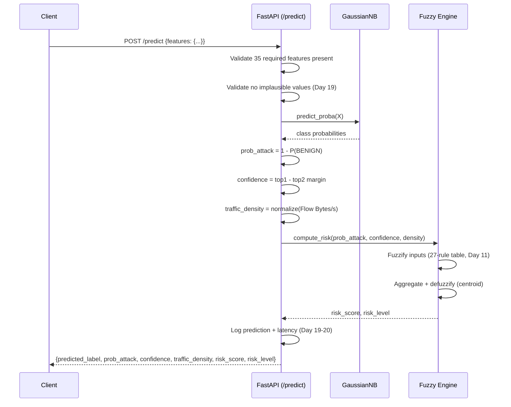

# Architecture

## Overview

SentinelML turns raw network flow records into graded intrusion risk
scores. Rather than a single binary classifier, it combines three
techniques, each addressing a specific weakness in a naive approach:

1. **Ant Colony Optimization (ACO)** removes redundant/uninformative
   features before classification (Day 5's EDA found many near-duplicate
   timing features; Day 6's MI ranking showed some features carry zero
   signal).
2. **Gaussian Naive Bayes** provides fast, interpretable classification —
   at the cost of the calibration and independence-assumption limitations
   documented throughout `docs/dataset.md` (Days 4, 10, 12, 13).
3. **Fuzzy inference** converts the classifier's imperfect probability
   output into a graded, human-readable risk level, rather than presenting
   a single brittle decision as ground truth.

This layering is a direct response to empirical findings, not an assumed
design — see `docs/dataset.md` for the full evidence trail (Day 4's
baseline failure, Day 10's ACO comparison, Day 12-13's probability
saturation finding).

## Component diagram
┌─────────────────┐
│ CICIDS2017 CSVs │
└────────┬─────────┘
│ ml/preprocessing.py
▼
┌──────────────────────┐
│ train.csv / test.csv │ (2.83M rows, 77 features, 15 classes)
└────────┬──────────────┘
│
├──► ml/eda.py ───────────────► reports/plots/*.png
├──► ml/mutual_information.py ─► reports/feature_scores.csv
│
▼
┌──────────────────────┐
│ ml/aco.py │ ◄── heuristic: MI scores
│ ml/aco_tuning.py │ ◄── fitness: macro F1 (GaussianNB on subsample)
└────────┬──────────────┘
│ selected 35/77 features
▼
┌──────────────────────┐
│ ml/train_final_model.py │
└────────┬──────────────┘
│ models/model.pkl, model_metadata.json
▼
┌────────────────────────────────────────────────┐
│ fuzzy/engine.py (probability, confidence, │
│ traffic_density -> risk) │
│ fuzzy/integration.py (model + engine, together) │
└────────┬───────────────────────────────────────┘
│
├──► api/main.py (FastAPI: /health, /model-info, /predict, /metrics)
│ │
│ └──► Docker (Dockerfile, docker-compose.yml)
│
├──► ml/mlflow_tracking.py ──► mlflow.db (experiment tracking + model registry)
│ │
│ └──► api/main.py loads latest registered version at startup (Day 21)
│
└──► mcp_server/server.py (5 tools exposing metrics/features/experiments
/deployment status/dataset info as natural-
language-queryable data via Claude Desktop)

## Sequence diagram: a single prediction request

## Why each design choice, briefly

| Choice | Why |
|---|---|
| ACO over simpler feature selection (e.g. top-k by MI) | Explores combinations, not just individually-ranked features — captures interactions a static ranking misses |
| Macro F1 (not accuracy) as ACO's fitness metric | Day 4 showed accuracy is misleading under 80%-BENIGN class imbalance |
| GaussianNB over a more complex classifier | Matches the original project brief's design; its specific limitations (documented, not hidden) motivate the fuzzy layer |
| Fuzzy inference over a fixed probability threshold | A single cutoff can't express "the model output is genuinely ambiguous, treat with medium suspicion" — fuzzy sets can |
| MLflow + model registry over just saving `.pkl` files | Versioned, queryable history; Day 21's API auto-loads the latest registered version rather than a hardcoded path |
| MCP server over just documentation | Lets the model's own metadata answer questions directly (Day 23 demonstrated this working, including independently re-deriving Day 4's class-imbalance diagnosis from raw metrics) |

## Known limitations (see `docs/dataset.md` for full detail)

- GaussianNB's probability output is nearly binary/saturated (Day 12),
  limiting how much nuance the fuzzy layer can extract
- BENIGN recall remains low (~8-9%) across both baseline and ACO-selected
  models — a model limitation, not fixed by feature selection alone
- Single-process API deployment saturates under high concurrency (Day 24)
- Rarest classes (Heartbleed: 11 total rows) have inherently noisy
  per-class metrics regardless of model quality

## Where to look for more detail

- `docs/dataset.md` — full day-by-day findings log with real numbers
- `docs/aco_design.md` — ACO's mathematical design and implementation notes
- `docs/plan.md` — the 4-week execution plan and completion status
